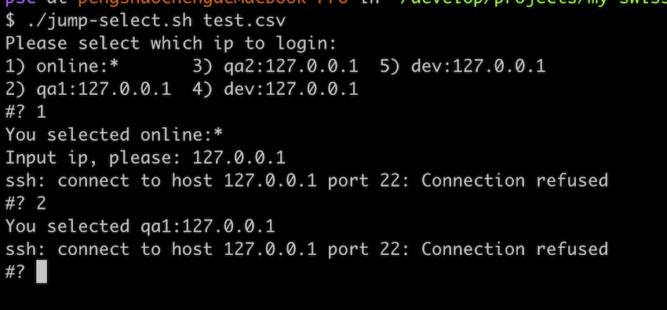

# my-swiss-army-knife.
This project collects my python and shell script in work. There are some useful script.

Now I want to introduce my cute useful script:
* modules/login/jump-select.sh

## jump-select.sh
This script is used to maintain lots of IP, user and password. For example, in my work,
there are many servers used by developers, qa testing, online service. 
You may feel terrible to remember all of those IPs, user names, passwords.
The script will give much convenience for you.

### HOW TO USE?
Firstly, create a csv config file:
```angular2
online,read_only,*,for_read,cd /opt/app/xxx
qa1,qa_user1,127.0.0.1,qa123,cd ~
qa2,qa_user2,127.0.0.1,qa456,cd ~
dev,dev_user1,127.0.0.1,dev_123,cd ~
dev,dev_user2,127.0.0.1,dev_456,cd ~
``` 
You can config many rows according to your need.
There are five columns in the csv.
* tag
* user name
* ip, support wildcard `*`. It you config `*` instead of any ip, it will read ip from interact input. 
* password
* command, the command will be executed when you login the remote server.

Secondly, install command `sshpass`:
MacOS:
`brew install sshpass`

Centos:
`yum -y install sshpass`

Ubuntu:
`apt-get  install sshpass`

At last, run script like this:
`./jump-select.sh <path_to_config> [-x]`

If you want to debug the script, with `-x` please.

